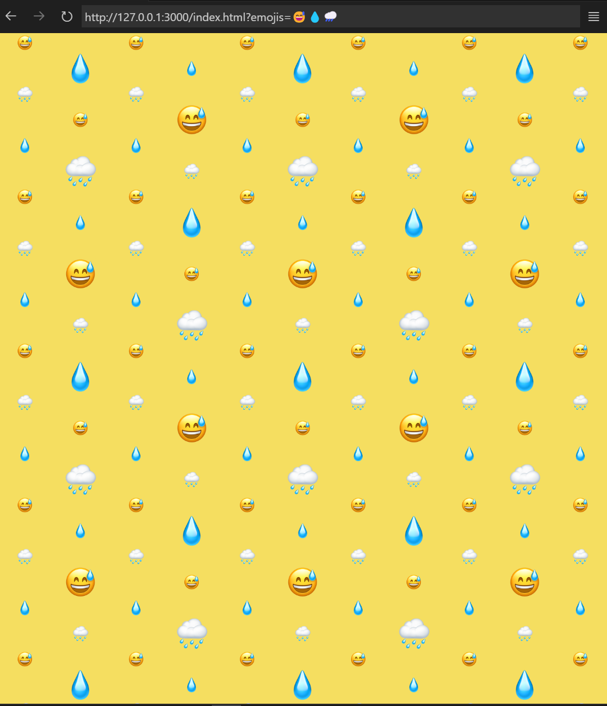

# EmojiWallpaper
Pretty simple project to generate an ios-like emoji wallpaper. 

## parameters
`?emojis=` : the emoji in the bg, can be more than one

## to do
- [ ] Add background color parameter
